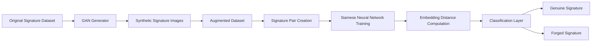
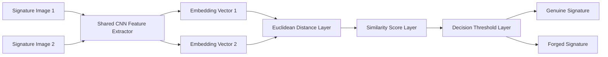
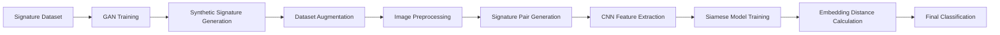

# Deep Learning–Based Fake Signature Detection using GANs and Siamese Neural Networks

## Project Overview

This project implements an intelligent handwritten signature verification system using Generative Adversarial Networks (GANs) and Siamese Neural Networks to detect forged signatures.

The model first enhances dataset diversity using GAN-generated synthetic signature samples and then trains a Siamese Neural Network to learn similarity relationships between signature pairs. The system predicts whether a signature is genuine or forged based on embedding distance between two signature images.

This solution reflects real-world banking use cases such as cheque verification, KYC authentication, and loan document validation.

---

## Business Problem

Manual signature verification in banking systems is:

• time-consuming
• subjective
• prone to human error
• difficult to scale for large transaction volumes

Financial institutions require automated verification pipelines that improve fraud detection accuracy and operational efficiency.

This project demonstrates how similarity-learning deep learning architectures can strengthen automated signature authentication workflows.

---

## Solution Architecture Overview

This project follows a two-stage deep learning pipeline:

Stage 1
GAN-based synthetic signature generation to increase dataset diversity

Stage 2
Siamese Neural Network similarity learning for forged signature detection

GAN improves robustness of the training dataset before similarity learning begins.

---

## GAN-Based Dataset Augmentation Pipeline

### Role of GAN in the Pipeline

GAN is used to generate realistic synthetic signature samples before Siamese network training.

This improves:

• dataset size
• handwriting variability coverage
• model generalization ability
• resistance to overfitting

GAN-generated signatures strengthen similarity-learning performance of the verification system.

---

## Siamese Neural Network Architecture

### Architecture Explanation

The Siamese Neural Network processes two signature images using a shared CNN feature extractor.

Both signatures are converted into embedding vectors.

Euclidean distance between embeddings determines similarity between signatures.

A decision threshold classifies whether the signature pair represents the same writer or a forgery.

This similarity-learning approach mirrors biometric verification systems used in banking fraud detection pipelines.

---

## Model Training Pipeline

---

## Technologies Used

Python
NumPy
OpenCV
TensorFlow / Keras
Convolutional Neural Networks (CNN)
Siamese Neural Networks
Generative Adversarial Networks (GANs)

---

## Project Workflow

1 Collect genuine and forged handwritten signature dataset
2 Train GAN model for synthetic signature generation
3 Augment dataset using GAN-generated signatures
4 Preprocess signature images (resizing and normalization)
5 Create signature image pairs (genuine–genuine and genuine–forged)
6 Extract handwriting features using CNN layers
7 Train Siamese Neural Network similarity-learning model
8 Compute embedding distance between signature pairs
9 Classify signatures as genuine or forged

---

## Dataset Description

The dataset contains handwritten signature samples categorized as:

• genuine signatures
• forged signatures

Signature image pairs are created in two formats:

• Genuine–Genuine pairs
• Genuine–Forged pairs

GAN-generated samples increase dataset diversity and improve similarity-learning performance.

---

## Model Evaluation Strategy

Model performance is evaluated using similarity-based classification metrics:

Accuracy
Precision
Recall
F1 Score
Confusion Matrix Analysis

These metrics measure how effectively the system distinguishes genuine signatures from forged signatures.

---

## Banking Fraud Detection Applications

This solution supports real-world verification workflows including:

Cheque signature verification
Loan document authentication
KYC verification systems
Insurance claim validation
Identity authentication pipelines
Financial fraud monitoring environments

---

## Real-World Fraud Risk Relevance

Signature verification is a critical control layer in preventing unauthorized financial transactions.

This project demonstrates how GAN-based dataset augmentation combined with Siamese similarity-learning architectures can improve automated fraud detection workflows in banking environments.

The solution aligns closely with AI-assisted verification strategies used in modern financial institutions.

---

## Future Enhancements

Deploy model using Streamlit interface

Convert solution into REST API using Flask

Integrate real-time verification workflow

Train on large-scale multi-writer signature datasets

Optimize similarity threshold tuning for production deployment

---

## Author

Sneha Kolge

Fraud Risk Management Professional transitioning into Data Science

Domain Expertise

Banking Operations
Fraud Risk Monitoring
AML Detection
Signature Verification Systems
AI-Based Fraud Detection
